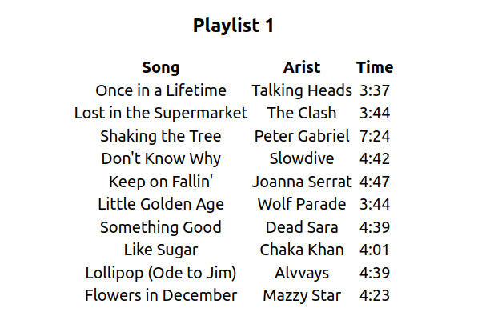

<meta charset="utf-8">

# My Playlist Exercise

<br>


## Praparing the work environment for the exercise:

<br>

<details><summary><b>If you didn't clone the repo, and create your own React App:</b></summary>

<br>


<ol>
<li>Create a react app in the directory that you want to work:
    
    npx create-react-app playlist-exercise
        
</li>
<li>
    Move into the newly created directory

    cd playlist-exercise
</li>
<li>
    Create a new folder inside the <strong>src</strong> folder and name it <strong>components</strong> 
</li>
<li>
    Create a new file named <strong>data.js</strong> inside your <strong>src</strong> folder. Copy the following into <strong>data.js</strong>:

```javascript
const playlist = [
  {
    artist: "Talking Heads",
    title: "Once in a Lifetime",
    time: "3:37",
  },
  {
    artist: "The Clash",
    title: "Lost in the Supermarket",
    time: "3:44",
  },
  {
    artist: "Peter Gabriel",
    title: "Shaking the Tree",
    time: "7:24",
  },
  {
    artist: "Slowdive",
    title: "Don't Know Why",
    time: "4:42",
  },
  {
    artist: "Joanna Serrat",
    title: "Keep on Fallin'",
    time: "4:47",
  },
  {
    artist: "Wolf Parade",
    title: "Little Golden Age",
    time: "3:44",
  },
  {
    artist: "Dead Sara",
    title: "Something Good",
    time: "4:39",
  },
  {
    artist: "Chaka Khan",
    title: "Like Sugar",
    time: "4:01",
  },
  {
    artist: "Alvvays",
    title: "Lollipop (Ode to Jim)",
    time: "4:39",
  },
  {
    artist: "Mazzy Star",
    title: "Flowers in December",
    time: "4:23",
  },
];

export default playlist;

```
</li>
<li>
You can start your React app with

````shell
npm start
````

</li>
</ol>

</details>

<details><summary><b>If you cloned the repo, how to build the cloned React app:</b></summary>

<ol>
<li>
Make sure that you are in the <strong>playlist-exercise</strong> folder on your terminal. 
</li>
<li>
Install the required packages with the following command:

````shel
npm i
````
</li>
<li>
You can start your React app with

````shell
npm start
````

</li>
</ol>

</details>

## Exercise:

<ol>
<li>
Create a new file in your <strong>components</strong> folder and name it <strong>Playlist.js</strong>
</li>
<li>
Create a functional component in <strong>Playlist.js</strong> which will have your main playlist format. Here feel free to use this HTML structure:

```html
    <main>
      <div>
        <h3>Playlist 1</h3>
        <table>
          <thead>
            <tr>
              <th>Song</th>
              <th>Arist</th>
              <th>Time</th>
            </tr>
          </thead>
          <tbody>
              <tr>
                <td>song title here</td>
                <td>artist name here</td>
                <td>track/song time here</td>
              </tr>
          </tbody>
        </table>
      </div>
    </main>
```

</li>
<li>
Import the <strong>Playlist</strong> component in your <strong>App.js</strong> file. 
</li>
<li>
Import the <strong>data.js</strong> file in your <strong>App.js</strong> file as well.
</li>
<li>
Save the contents of the <strong>data.js</strong> file, which is an array of object literals, in a variable. Hint, you can use the <strong>useState()</strong> hook for this task.
</li>
<li>Your <strong>App.js</strong> file should only have your <strong>Playlist</strong> component and you should pass down the playlist data state down from the <strong>App</strong> -->  <strong>Playlist</strong> 
<br>
State can only move from <strong>Parent</strong> --to--> <strong>Child</strong> component

<br>

have a look at the example below :)

<br>

<strong>App.js</strong>

```jsx
function App() {
  const [songName, setSongName] = useState('Master of Puppets')

  return (
    <div className="App">
      <Playlist songName={songName}/>
    </div>
  );
}
```
<br>

<strong>Playlist.js</strong>

```jsx
const Playlist = ({songName}) => {
    return(
        <div>{songName}</div>
    )
};

export default Playlist;
````

</li>

<li>
In your <strong>Playlist</strong> component when you are placing the name of the songs you want to leverage the <strong>map()</strong> method on your <strong>playlist</strong> array data.

<br>

Read [THIS](https://reactjs.org/docs/lists-and-keys.html) before you move on the exercise :smile:

<br>
<details><summary>Open if you want a hint on this:</summary>

```jsx
{playlist.map((song, i) => (
              <tr key={i}>
                <td>{song.title}</td>
                <td>{song.artist}</td>
                <td>{song.time}</td>
              </tr>
            ))}
```

</details>

<br>

</li>

<li>
Your final project should look like this 

<br>



</li>
</ol>